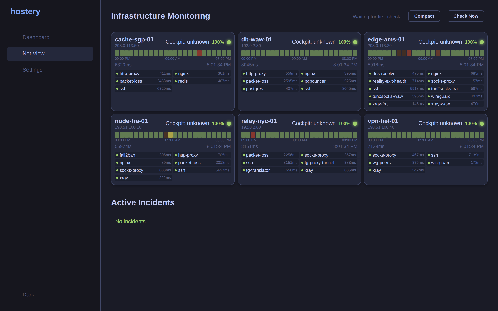
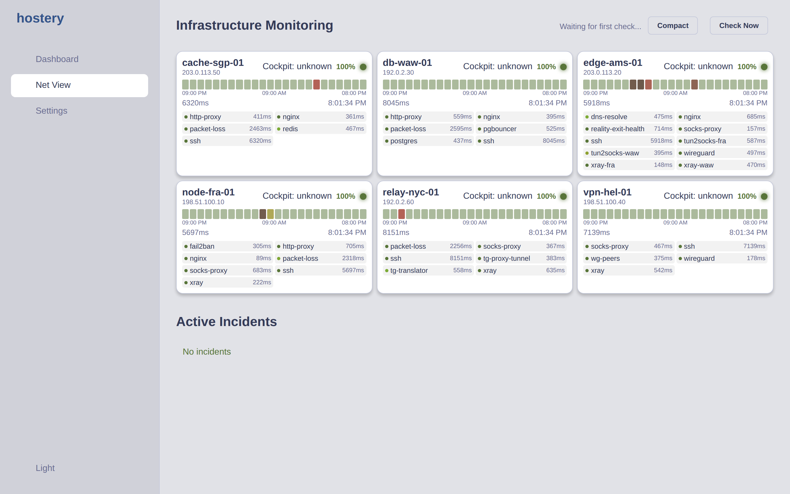
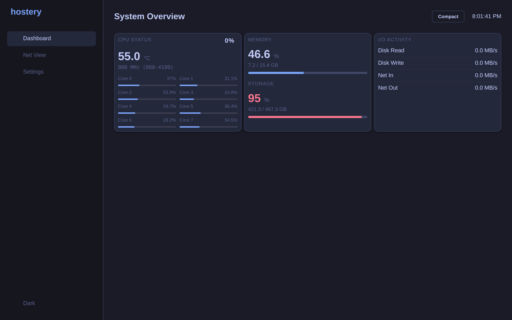
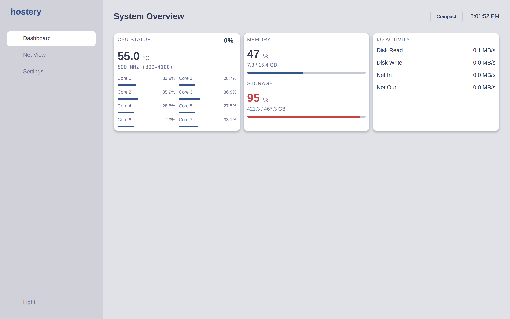
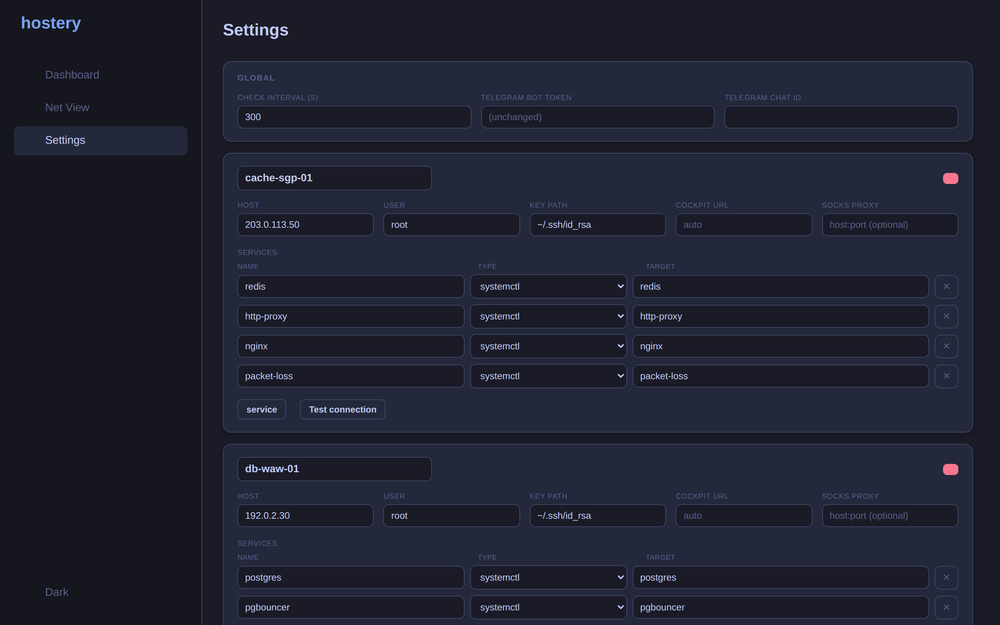
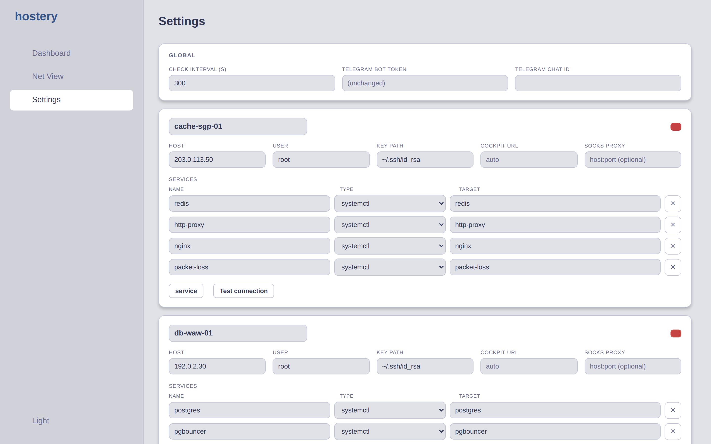

[Русский](README.md) · **English**

# hostery

hostery is a generic self-hosted server fleet monitor. It runs as a lightweight Flask web application and provides four views: a local host **Dashboard** (CPU temperature, frequency, fan speed, load average, RAM, disk, I/O rates; a Raspberry Pi Power Health module is auto-enabled when `vcgencmd` is detected on the host), a configurable SSH-based **Net View** that polls a fleet of remote servers and shows 24-hour availability timelines, 30-day uptime percentages, incident history, and Telegram alerts, a **Settings** tab with a live config editor (no restart needed), and a **Cockpit** bridge that detects, installs, and links Red Hat Cockpit on each managed server.

## Screenshots

The data shown is a fictional fleet (addresses from the RFC 5737 documentation
ranges); no real servers are exposed. The theme is switched with the toggle in
the sidebar (follows the OS preference by default).

### Net View — infrastructure monitoring

| Dark | Light |
|---|---|
|  |  |

### Dashboard

| Dark | Light |
|---|---|
|  |  |

### Settings

| Dark | Light |
|---|---|
|  |  |


## Quick start (Docker)

```bash
cp config/config.example.json config/config.json
# Edit config/config.json — add your servers, SSH user/key, services to monitor
docker compose up -d
```

Open `http://127.0.0.1:5000`.

On first run, if `HOSTERY_AUTH` is not set, a random admin password is generated and printed in the logs. Read it with:

```bash
docker compose logs | grep password
```

By default the container mounts `~/.ssh` into `/root/.ssh` (read-only) so your existing SSH keys are available for fleet polling. Point to a different directory with the `SSH_KEYS_DIR` environment variable:

```bash
SSH_KEYS_DIR=/home/youruser/.ssh docker compose up -d
```

## Quick start (clone & run)

```bash
python3 -m venv venv
./venv/bin/pip install -r requirements.txt
cp config/config.example.json config/config.json
# Edit config/config.json
./venv/bin/python app.py
```

Open `http://127.0.0.1:5000`.

Two environment variables control the bind address and port:

| Variable | Default | Description |
|---|---|---|
| `HOSTERY_BIND` | `127.0.0.1` | Interface to listen on (`0.0.0.0` to expose on all interfaces) |
| `HOSTERY_PORT` | `5000` | TCP port |

## Authentication

HTTP Basic Auth is enabled by default. The behaviour depends on the `HOSTERY_AUTH` environment variable:

- **Unset (default)** — a random password for the `admin` user is generated at startup and printed in the logs. Read it once, then optionally fix it with `HOSTERY_AUTH`.
- **`HOSTERY_AUTH=user:pass`** — credentials are fixed to the given values.
- **`HOSTERY_AUTH=off`** — authentication is disabled. Only use this when another layer (mTLS, a reverse-proxy auth gate, SSO) sits in front of hostery. Never expose an unauthenticated instance directly to the internet.

## Configuration

Configuration lives in `config/config.json`. The annotated example is at `config/config.example.json`.

**Top-level keys:**

| Key | Description |
|---|---|
| `check_interval` | Seconds between fleet polls (default 300) |
| `ssh_timeout` | SSH connection timeout in seconds |
| `retention_days` | How many days of check history to keep |
| `telegram` | `bot_token` and `chat_id` — both must be non-empty to enable alerts |
| `servers` | Map of server name → server object |

**Server object:**

| Key | Description |
|---|---|
| `host` | Hostname or IP |
| `user` | SSH login user |
| `key` | Path to private key (e.g. `~/.ssh/id_rsa`) |
| `cockpit_url` | Optional Cockpit URL override; auto-detected if blank |
| `socks` | Optional SOCKS5 proxy for SSH as `host:port` (e.g. an `ssh -D` / autossh tunnel). Use when the host is only reachable through a proxy. Mutually exclusive with `jump` |
| `jump` | Name of another server in `servers` to proxy the SSH connection through (ProxyJump). Use when the host is only reachable via a bastion/intermediate node. Mutually exclusive with `socks` |
| `ssh_port` | SSH port (default `22`) |
| `services` | List of service checks (see below) |
| `custom_checks` | List of custom shell checks (see below) |
| `muted` | List of service names hidden from status and alerts (managed by the mute button in the UI) |

**Service check types:**

A bare string is shorthand for a systemd unit check (`{"type": "systemctl", "unit": "<name>"}`).

| Type | Extra fields | Checks |
|---|---|---|
| `systemctl` | `unit` | Unit is active via `systemctl is-active` |
| `port` | `port` | TCP port is open |
| `docker` | `container` | Container is running |
| `interface` | `iface` | Network interface is UP |
| `wireguard` | `iface` | WireGuard interface is UP and has a recent handshake |
| `http` | `url`, `expect_code` | HTTP GET returns the expected status code |

**Custom checks (`custom_checks`):**

Each entry runs an arbitrary shell command over SSH and evaluates its stdout output against a numeric expression.

| Field | Required | Description |
|---|---|---|
| `name` | yes | Human-readable label |
| `command` | yes | Shell command to run on the remote host (stdout is captured as a number) |
| `expect` | yes | Numeric comparison, e.g. `"> 0"`, `"== 1"`, `"<= 20"` |
| `warn_if` | no | Secondary threshold expression that triggers a warning (non-critical) alert |
| `severity` | no | `critical` (default) or `warning` |
| `description` | no | Displayed in the UI as a tooltip or label |

Example — alert if root filesystem free space drops below 10 %:

```json
{
  "name": "disk-free",
  "command": "df -P / | awk 'NR==2{print 100-$5+0}'",
  "expect": "> 10",
  "severity": "warning",
  "description": "Root filesystem free percent"
}
```

Configuration hot-reloads: edits saved through the **Settings** tab (or directly to the file) take effect on the next poll cycle without restarting hostery.

## Raspberry Pi module

When `vcgencmd` is present on the host, hostery automatically enables a **Power Health** panel in the Dashboard. It shows throttle and undervoltage event history, current core voltage, and PMIC power readings. On non-Pi hardware the panel is absent and no related code runs.

## Cockpit

Each server entry in Net View shows a Cockpit status chip. Two actions are available:

- **Install Cockpit** — connects over SSH and runs the official Cockpit install command. The target server must allow root login or have passwordless `sudo` configured for the SSH user. The install opens port 9090 on the target; hostery does **not** automatically add firewall rules.
- **System console** — opens or links the Cockpit web UI for that server.

Cockpit has no REST API, so hostery links and installs it rather than driving it programmatically. The install action is the only state-changing remote operation hostery performs and requires an explicit click in the UI.

## Security note

`command` fields in `custom_checks` run operator-authored shell commands on remote hosts over SSH. This is intentional — the operator controls both the hostery instance and the target hosts. The HTTP Basic Auth gate is the access control boundary for the hostery UI itself.

The Cockpit install is the only action that modifies a remote host's state. It is triggered by an explicit UI action, not by a scheduled poll.

Never disable authentication (`HOSTERY_AUTH=off`) unless a stronger auth layer (mTLS, reverse-proxy auth, SSO) is enforced upstream.

## Development & tests

```bash
./venv/bin/pip install -r requirements.txt -r requirements-dev.txt
./venv/bin/playwright install chromium
./venv/bin/pytest                      # unit tests (E2E excluded by default)
./venv/bin/pytest tests/e2e -m e2e     # Playwright end-to-end tests
```

Unit tests cover the generic sensor fallbacks, the config-driven check model, the timeline/incident machinery, config validation, authentication, and the Cockpit helpers. The E2E suite launches the app against a deterministic test fleet (a fake fleet on `127.0.0.1` so SSH-backed actions fail fast) and drives the SPA in a headless browser across all the main scenarios (auth gate, dashboard metrics, navigation, fleet rendering, the config editor, validation, and the Cockpit controls).

For the module architecture, the theme system, and how screenshots are regenerated, see [docs/DEVELOPMENT.md](docs/DEVELOPMENT.md).
